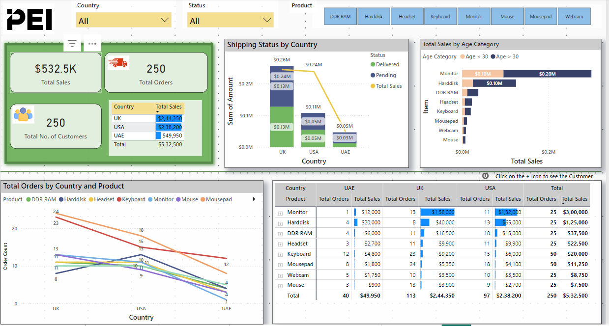

# Sales Analysis for the Retail Industry  

## Introduction  
This project focuses on analyzing sales data for the retail industry to derive insights that can help improve sales performance based on customer behavior and country-specific trends.  

## Problem Statement  
The analysis aims to answer the following key business questions:  
1. Identify the **total amount spent and the country-wise breakdown** for pending deliveries.  
2. Determine the **total number of transactions, total quantity sold, total amount spent for each customer, and product details**.  
3. Identify the **most purchased product in each country**.  
4. Find the **most purchased product based on age category (<30 and >30 years old)**.  
5. Determine the **country with the minimum number of transactions and sales amount**.  

## Skills Demonstrated  
This project leverages various Power BI features, including:  
- **Bookmarking**  
- **DAX (Data Analysis Expressions)**  
- **Quick measures**  
- **Page navigation**  
- **Data modeling**  
- **Filters and tooltips**  
- **Buttons for navigation**  

## Data Source  
The data was provided by **PEI for assessment purposes**. Three different files were downloaded from Google Drive and directly connected to Power BI.  

### Dataset Details  
1. **Shipping details** – JSON format (3 columns, 250 rows)  
2. **Customer details** – Excel format (5 columns, 250 rows)  
3. **Order details** – CSV format (4 columns, 250 rows)  

## Data Preparation  

### Data Cleaning & Transformation  
- Promoted headers for each table.  
- Created a **separate measure table** for better organization.  
- Added a **refresh table** to monitor data update frequency.  

### Data Modeling  
- Power BI **automatically identified related tables**, resulting in a **star schema model**.

- Adjusted the model, treating:  
  - **Order Table** as a **Fact Table**  
  - **Shipping Table** as another **Fact Table**  
  - **Customer Table** as a **Dimension Table**  
- Established a **many-to-many relationship** between the **Order Table** and **Shipping Table** due to business requirements.  
- Defined a **one-to-many relationship** between Customers and Orders.  

## Data Blending  
- **Converted the JSON file to CSV using Jupyter Notebook** (Jupyter Notebook file is included in the repository).  

## Power BI Reports & Visualizations  
The Power BI report consists of **four key pages**:  
1. **Introduction** – Overview of the analysis.  
2. **Summary** – Key business insights.  
3. **Missing Shipping to Customers** – Identifies missing shipping IDs.  
4. **Tooltip** – Provides additional details on delivery status.  

### Features & Insights  
- **Summary page includes tooltips** to help users quickly interpret delivery statuses.  
- Analysis findings:  
  1. **Pending Deliveries**: The total amount spent and pending delivery status by country.
     
     
     
  3. **Customer Analysis**: Total transactions, total quantity sold, and spending per customer.
  
  4. **Top-Selling Products per Country**:  
     - **UK** – Mousepad  
     - **USA** – Mousepad  
     - **UAE** – Keyboard
       
  
  5. **Top-Selling Products by Age Group**:  
     - Monitors were the most purchased product across all three countries.  
  6. **Lowest Sales & Transactions**:  
     - **UAE had the lowest number of transactions and sales amount**.  

## Conclusion  
- **Data Quality**: The dataset is **clean**, with no missing values in the key tables.  
- **Missing Shipping Data**: Some **shipping IDs were missing**, especially for **USA orders**.  
- **Lack of Date Information**: The dataset does not include timestamps, making it impossible to track delivery times or pending orders over time.  

## Technical Recommendations for Data Engineering  
1. **Order Table does not include Shipping ID as a Foreign Key**, making it difficult to track missing deliveries.  
2. **Solution**: Create an **Order ID column in the Shipping Table as a Foreign Key** and update the data accordingly.  

## Repository Contents  
- **Power BI File (.pbix)** – Contains the full report and visualizations.  
- **Jupyter Notebook (.ipynb)** – Code used to convert JSON to CSV.  
- **Data Files (.csv, .xls, .json)** – The raw data used for analysis.  
